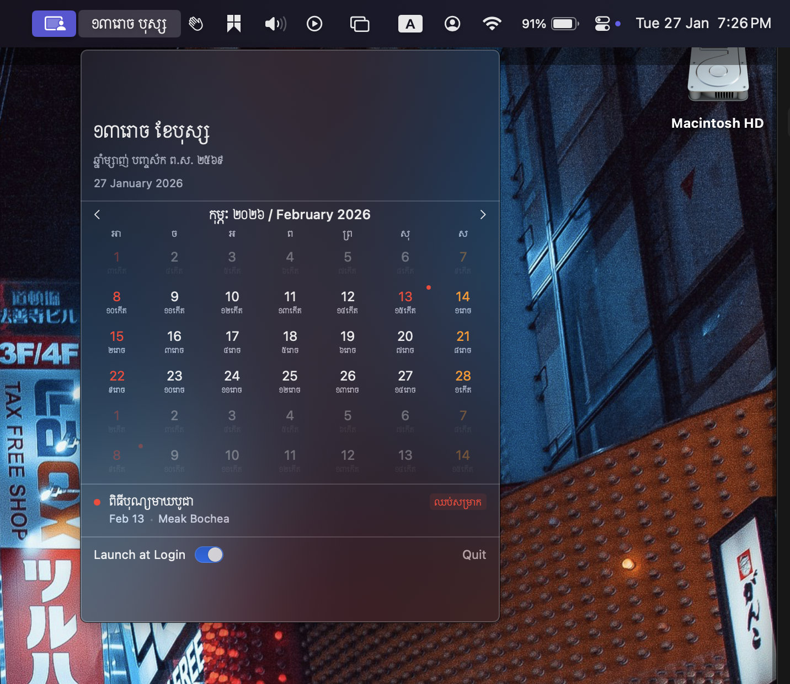

# KhmerCalendarBar

A native macOS menu bar app that displays the Khmer Chhankitek (ចន្ទគតិ) lunisolar calendar.



## Features

- **Menu Bar Date** — Shows current Khmer lunar date (e.g. "១កោះមាច បុស្ស")
- **Monthly Calendar Grid** — Dual Gregorian + Khmer lunar dates
- **Chhankitek Engine** — Full Gregorian ↔ Khmer lunisolar conversion
- **Lunar Phases** — កើត (waxing) / រោច (waning) / កោះ (new moon)
- **Buddhist Era** — ពុទ្ធសករាជ year display
- **Animal Year Cycle** — 12 Khmer animal years (ជូត, ឆ្លូវ, ខាល, ...)
- **Sak Era** — 10 Sak cycle (ឯកស័ក, ទោស័ក, ...)
- **Public Holidays** — Fixed (Gregorian) + lunar-based Khmer holidays
- **Holiday Indicators** — Red dots on calendar, detailed list below
- **Khmer Numerals** — Full Unicode Khmer numeral display (០១២៣៤៥៦៧៨៩)
- **Month Navigation** — Browse past and future months
- **Launch at Login** — Auto-start on macOS boot
- **Midnight Refresh** — Automatically updates at midnight

## Requirements

- macOS 14.0 (Sonoma) or later
- Apple Silicon or Intel Mac

## Build

```bash
# Debug build
swift build

# Release build + app bundle
./build-app.sh
```

The build script creates `KhmerCalendarBar.app` and `KhmerCalendarBar.zip` for distribution.

## Install

```bash
# From zip
unzip KhmerCalendarBar.zip
mv KhmerCalendarBar.app /Applications/

# Or run directly
swift run
```

## Architecture

```
KhmerCalendarBar/
├── Models/              # Data models
│   ├── KhmerDate        # Core Khmer date struct
│   ├── KhmerMonth       # 12+2 lunar months
│   ├── KhmerAnimalYear  # 12 animal cycle
│   ├── KhmerSak         # 10 Sak era cycle
│   ├── MoonPhase        # Waxing/waning phases
│   ├── KhmerHoliday     # Holiday model
│   ├── DayInfo          # Combined day info for grid
│   └── CalendarConstants# Khmer Unicode strings
├── Engine/              # Calendar conversion engine
│   ├── ChhankitekEngine # Main Gregorian ↔ Khmer conversion
│   ├── AstronomicalCalculations # Aharkun, Bodethey, Avoman
│   ├── LeapYearCalculator       # Adhikameas/Adhikavar detection
│   ├── NewYearCalculator        # Khmer New Year computation
│   ├── MonthNavigator           # Month sequencing with leap
│   └── JulianDayConverter       # Julian Day Number bridge
├── Services/            # Business logic
│   ├── HolidayService          # Fixed + lunar holidays
│   ├── DateFormatterService    # Khmer date formatting
│   └── KhmerNumeralService     # Arabic ↔ Khmer numerals
├── ViewModels/
│   └── CalendarViewModel       # State + midnight timer
├── Views/               # SwiftUI views
│   ├── PopoverContentView      # Main popover layout
│   ├── TodayHeaderView         # Today's Khmer date
│   ├── MonthNavigationView     # Month navigation
│   ├── CalendarGridView        # 7-column calendar grid
│   ├── DayCellView             # Day cell (dual dates)
│   ├── HolidayListView         # Monthly holidays
│   └── FooterView              # Launch at Login, Quit
└── Utilities/
    └── LaunchAtLogin           # SMAppService wrapper
```

## Khmer Calendar Engine

The Chhankitek engine converts Gregorian dates to Khmer lunar dates using epoch-based astronomical calculations:

1. **Julian Day Number** — Bridge between Gregorian and internal day counting
2. **Aharkun** — Days elapsed from the epoch
3. **Bodethey / Avoman** — Excess day and lunar excess calculations
4. **Leap Detection** — Determines Adhikameas (leap month, 384 days), Adhikavar (leap day, 355 days), or normal year (354 days)
5. **New Year** — Computes exact Moha Songkran date
6. **Conversion** — Skips full years → skips full months → remaining days = lunar day + phase

## Holidays

**Fixed (Gregorian):**
- International New Year (Jan 1)
- Victory over Genocide Day (Jan 7)
- International Women's Day (Mar 8)
- International Workers' Day (May 1)
- King's Birthday (May 13-15)
- Constitution Day (Sep 24)
- Independence Day (Nov 9)

**Lunar-based (computed each year):**
- Choul Chnam Thmey (Khmer New Year)
- Visak Bochea
- Pchum Ben (15-day festival)
- Water Festival (Bon Om Touk)
- Meak Bochea
- Royal Ploughing Ceremony

## License

MIT
